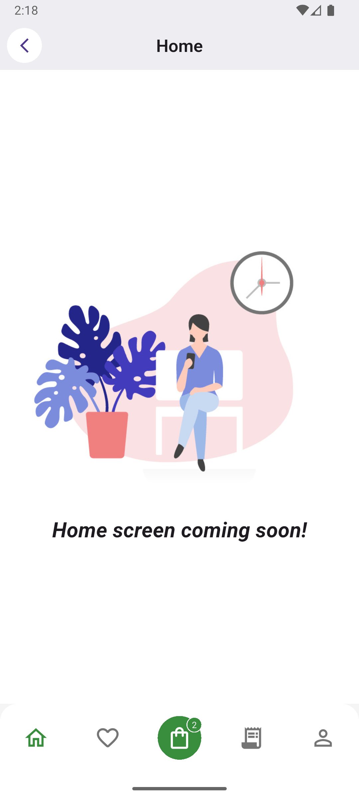
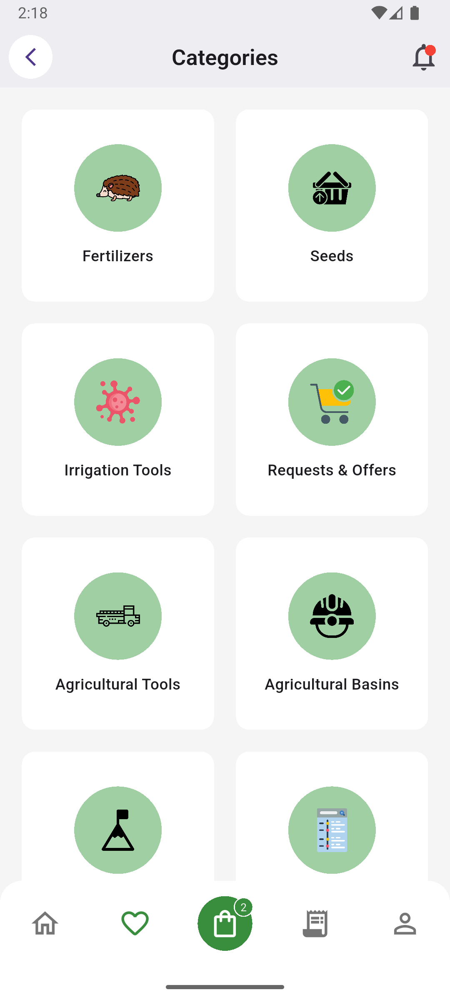
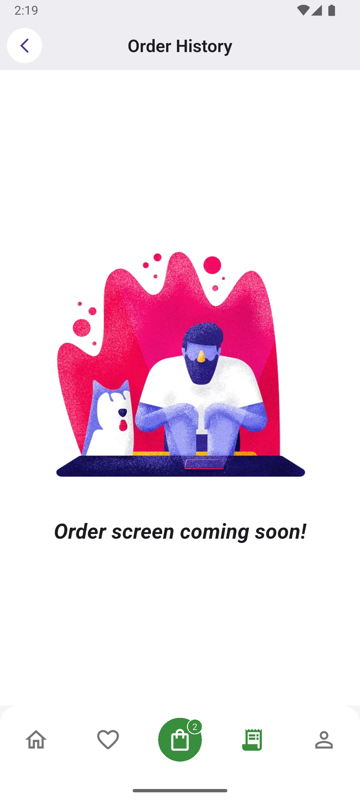
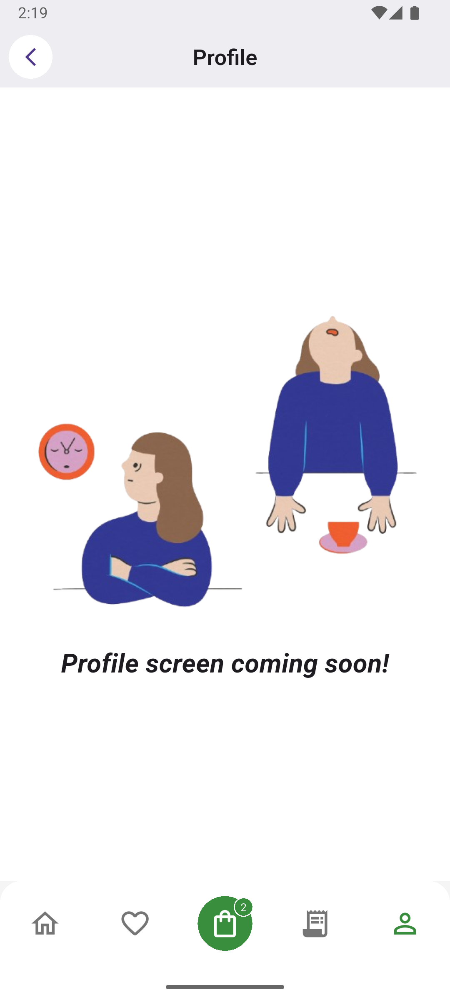

# 🗂️ CodForge Flutter Developer Assignment

A simplified Category screen implementation with pagination, Riverpod state management, and feature-based architecture.

---

## 🚀 Features

- ✅ BottomNavigationBar with 5 tabs (only Category tab fully functional)
- ✅ Riverpod (latest) for state management
- ✅ Lazy-loaded paginated categories with mock API 
- ✅ Full state handling: loading, error, no data, success
- ✅ Clean UI with GridView layout
- ✅ Feature-first folder structure
- ✅ Pull-to-refresh  
- ✅ Responsive UI with custom illustrations and design polish  
- ✅ SOLID-compliant architecture with clean code and reusability  

---

## 🧱 Tech Stack

| Layer              | Implementation                            |
|-------------------|--------------------------------------------|
| State Management   | [Riverpod](https://riverpod.dev) (v2)     |
| Architecture       | Feature-first + Clean + SOLID Principles  |
| API                | [Mocki.io](https://mocki.io) (Fake REST API) |
| UI                 | Material3, GridView, Custom Components     |

---

## 📂 Folder structure

<pre>lib/
├── core/                 
│   ├── constants/
│   └── widgets/
├── data/
│   └── models/
├── modules/
│   └── cart/
│   └── category/
│       ├── widgets/
│       ├── category_controller.dart
│       └── category_screen.dart
│   └── home/
│   └── order/
│   └── profile/
├── router/
│   └── navigation_bar.dart
├── app.dart
└── main.dart</pre>

---

## 🛠️ Setup Instructions

1. **Clone the repo**
   ```bash
   git clone https://github.com/shuchitajain/codforge_flutter_project.git
   cd codforge_flutter_project

2. **Install flutter dependencies**
   ```bash
   flutter pub get

2. **Run the app**
   ```bash
   flutter run

---

## 🧪 Testing Guide
    Currently manual testing is performed via:

    * Scroll to bottom for pagination
    * Turn off WiFi and restart the app (because data is cached for that session) to trigger offline error state
    * Delete mock data response to trigger "No Data" (refer TODO)
    * Pull down to test refresh indicator

---

## 🌐 Mock API Details
    * Endpoint: https://mocki.io/v1/0a9d1078-3b76-4d18-8378-89669fc255ea
    * Returns: JSON list of 20 agricultural categories with icon URLs
    * Used in: ApiCategoryRepository

---

## 📷 Screenshots

<table>
  <tr>
    <td align="center">
      🏠 <br/> <strong>Home Screen</strong><br/>
      
    </td>
    <td align="center">
      🔄 <br/> <strong>Category Screen</strong><br/>
      
    </td>
  </tr>
  <tr>
    <td align="center">
      🛒 <br/> <strong>Cart Screen</strong><br/>
      
    </td>
    <td align="center">
      📦 <br/> <strong>Order History Screen</strong><br/>
      
    </td>
  </tr>
  <tr>
    <td align="center" colspan="2">
      👤 <br/> <strong>Profile Screen</strong><br/>
      
    </td>
  </tr>
</table>

---

## 👨‍💻 Author
    Made with ❤️ for CodForge by SJ
